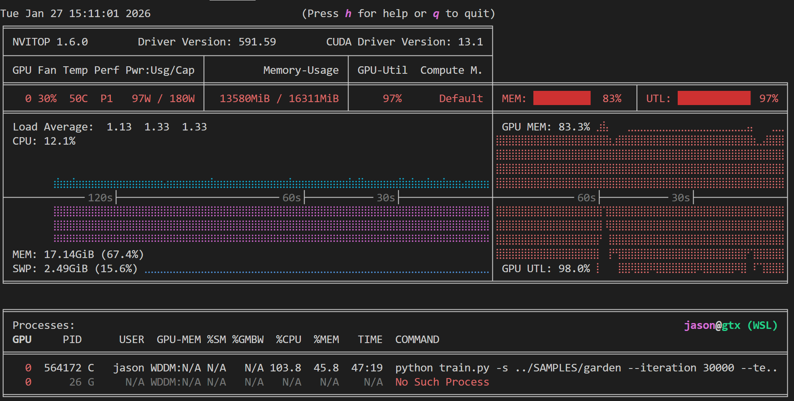
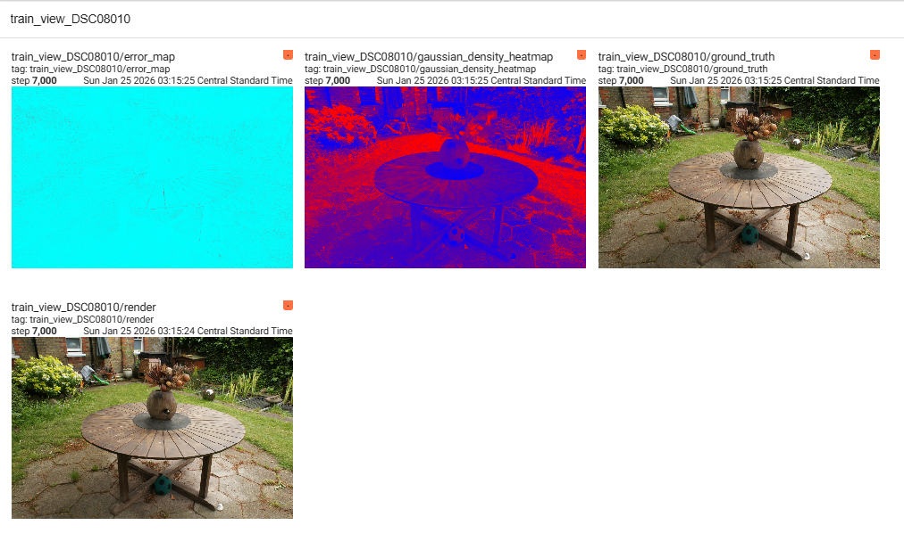
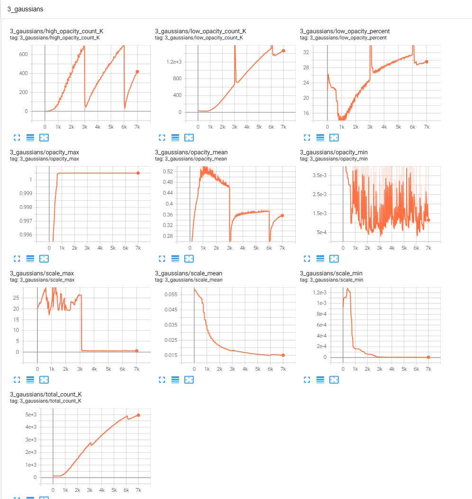
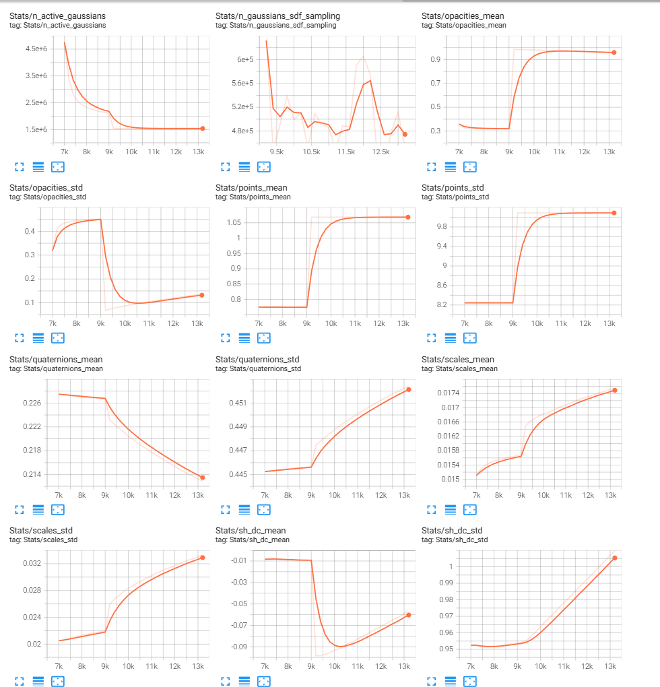
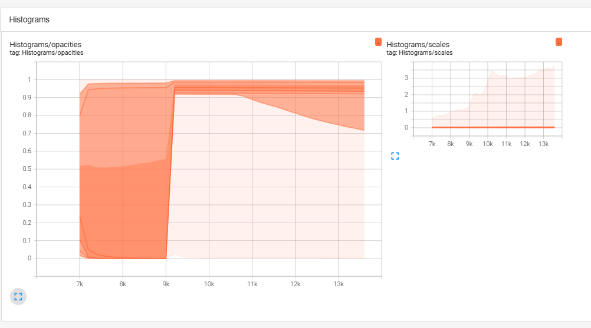
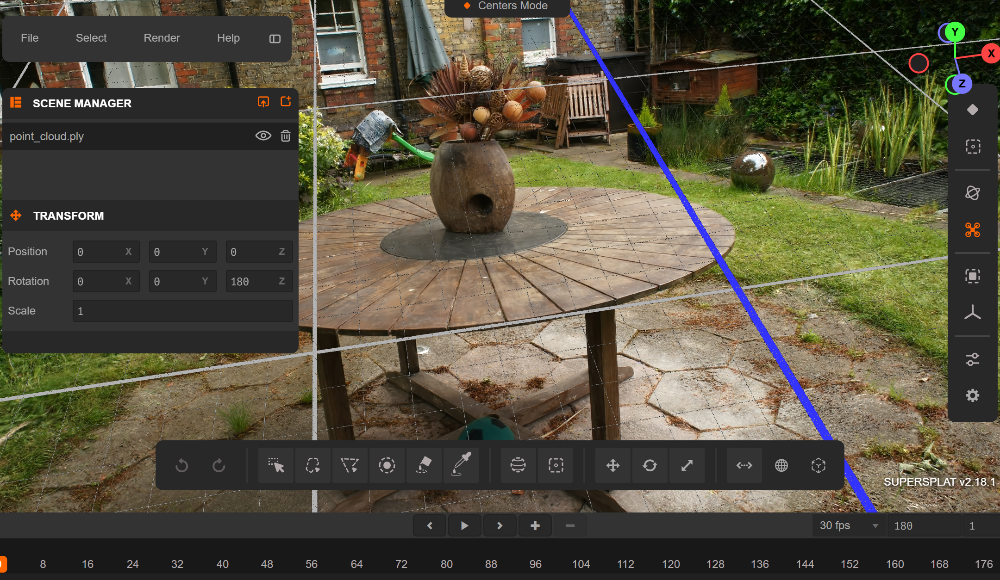

# SuGaR v3 - Optimized 3D Gaussian Splatting to Mesh Pipeline

<div align="center">

**Mip-Splatting → SuGaR → Textured Mesh**

*Production-ready pipeline tested on NVIDIA RTX 5060 Ti (16GB VRAM)*

[](https://www.python.org/downloads/)
[](https://developer.nvidia.com/cuda-downloads)
[](https://pytorch.org/)
[](LICENSE)

</div>

---

## 🎯 What is This?

**SuGaR v3** is an optimized implementation of the **Mip-Splatting → SuGaR pipeline** for converting 3D scenes into high-quality textured meshes. This version features 12+ optimizations achieving **2-6× speedup** and **15.7GB VRAM usage** (down from 18-19GB), making it practical for consumer GPUs.

### Key Features

- ✅ **VRAM Optimized** - 15.7GB usage on RTX 5000 series 16GB+ GPUs (tested on 5060 Ti) - down from 18-19GB
- ✅ **2-6× Faster Training** - TF32 Tensor Cores, cuDNN auto-tuning, lazy loading, KNN caching
- ✅ **60-80× Faster Initialization** - Cached KNN neighbors (5s vs 5-6 min), persistent between runs
- ✅ **10-60× Faster Textures** - nvdiffrast GPU rasterization (~10s vs minutes)
- ✅ **Memory Leak Fixed** - TensorBoard histogram cleanup, no VRAM/RAM creep over 15K iterations
- ✅ **TensorBoard Monitoring** - Real-time metrics, VRAM tracking, histograms (SuGaR integration created from scratch)
- ✅ **Rich Console UI** - Professional terminal output with tables, progress indicators, color-coded messages
- ✅ **Resume Training** - Auto-checkpoints every 1K iterations, resume from any point with validation
- ✅ **Full Pipeline** - Mip-Splatting (7K iter, ~30min @ -r2 or ~2.5hrs @ -r1) → SuGaR (15K iter, ~2-3 hours) → Textured mesh
- ✅ **Modern Hardware** - PyTorch 2.11, CUDA 13.x, native Blackwell (sm_120) support

---

## 🎯 What Can You Build?

### Real-World Outcomes
- 🌐 **Web 3D Viewers** - Export to Three.js, Babylon.js, or Sketchfab for interactive sharing
- 🎮 **Game Environments** - Import into Unity/Unreal with collision meshes and optimized LODs
- 🥽 **VR/AR Experiences** - Photorealistic real-world rooms in Meta Quest, Vision Pro, HoloLens
- 📱 **Mobile Apps** - Lightweight textured meshes for iOS/Android AR (ARKit, ARCore)
- 🎬 **Film Assets** - Hero props and set extensions from photogrammetry scans
- 🏗️ **Digital Twins** - Editable CAD meshes for architecture and construction

### Typical Workflows
1. **iPhone Scan → 3D Model → Web Share**  
   Record with Polycam → Train with SuGaR → Export to Sketchfab → Share link
   
2. **Room Scan → Unity VR Scene**  
   Capture 200 photos → Extract mesh → Import to Unity → Build Quest 2 app
   
3. **Product Scan → E-commerce 3D Viewer**  
   Turntable photos → Train Gaussians → Bake textures → Embed in website

4. **Historical Site → Research Archive**  
   DSLR photogrammetry → High-poly mesh → Blender cleanup → Museum exhibit

---

## 📖 What is Gaussian Splatting?

**3D Gaussian Splatting** (SIGGRAPH 2023) represents 3D scenes as millions of tiny 3D Gaussian "splats" rather than polygons. Each splat has position, color, opacity, and shape - allowing photorealistic novel view synthesis.

**Why it matters:**
- 🚀 **10-100× faster rendering** than NeRF (neural radiance fields)
- 📸 **Better quality** from fewer input photos (50-200 vs 500+ for NeRF)
- ⚡ **Real-time capable** on consumer GPUs (60+ FPS)
- 🔧 **Editable** - Can convert to standard meshes (that's what this project does!)

**Learn more:**
- 📄 [3D Gaussian Splatting (Original Paper)](https://repo-sam.inria.fr/fungraph/3d-gaussian-splatting/) - Kerbl et al., SIGGRAPH 2023
- 📄 [SuGaR: Surface-Aligned Gaussians (Our Method)](https://arxiv.org/abs/2311.12775) - Guédon & Lepetit, CVPR 2024
- 🎥 [Gaussian Splatting Explained (YouTube)](https://www.youtube.com/watch?v=VkIJbpdTujE) - Two Minute Papers visual introduction
- 🌐 [Awesome Gaussian Splatting](https://github.com/MrNeRF/awesome-3D-gaussian-splatting) - Comprehensive resource list

**This project bridges the gap:** Gaussian Splatting is amazing for rendering, but games/VR/CAD need traditional meshes. SuGaR extracts clean, textured meshes that work everywhere.

---

## 🎨 Who Is This For?

### Perfect For:
- 🏛️ **Architectural visualization** - Interior/exterior scans for presentations and walkthroughs
- 🎮 **Game developers** - Photorealistic assets from real-world scans (props, environments, characters)
- 🎬 **VFX artists** - Film-quality 3D assets from on-set photogrammetry
- 🤖 **ML researchers** - Novel view synthesis, 3D reconstruction, scene understanding
- 🏠 **Real estate professionals** - Virtual tours with editable models for staging
- 🏛️ **Cultural preservation** - Digitize historical sites and artifacts
- 📱 **AR/VR developers** - Real-world environments for immersive experiences

### Technical Users:
- GPU access (16GB VRAM recommended)
- Comfortable with command-line tools
- Basic understanding of 3D workflows (Blender, Unity, etc.)
- Python/conda experience helpful but not required

---

## 🚀 Quick Start

### Installation (3 Steps)

**1. Install WSL2 (Windows only) + NVIDIA Driver 570+**

**2. Install CUDA 13.0 in WSL2/Linux:**
```bash
wget https://developer.download.nvidia.com/compute/cuda/repos/wsl-ubuntu/x86_64/cuda-keyring_1.1-1_all.deb
sudo dpkg -i cuda-keyring_1.1-1_all.deb
sudo apt-get update
sudo apt-get install -y cuda-toolkit-13-0
export PATH=/usr/local/cuda-13.0/bin:$PATH
export LD_LIBRARY_PATH=/usr/local/cuda-13.0/lib64:$LD_LIBRARY_PATH
nvcc --version  # Verify: should show release 13.0
```

**3. Run installation script:**
```bash
git clone https://github.com/jaybodecode/sugar-optimized-5000rtx.git
cd sugar-optimized-5000rtx
bash install.sh -y
```

### Usage

```bash
# 1. Activate environment
conda activate sugar

# 2. Train Gaussians with Mip-Splatting
cd mip-splatting/
# 16GB VRAM: Use -r 2 for high-res datasets (~30 min @ 7K iter)
python train.py -s /path/to/dataset --iteration 7000 -r 2
# 32GB VRAM: Can use -r 1 for max quality (~2.5 hrs @ 7K iter)

# 3. Extract textured mesh with SuGaR (~2-3 hours)
cd ../SuGaR/
python train_full_pipeline.py \
  -s /path/to/dataset \
  --gs_output_dir /path/to/mip-output/<timestamp> \
  -r dn_consistency \
  --high_poly True \
  --refinement_time long
```

**Sample datasets not included - download separately (see [SAMPLES.md](SAMPLES.md))**

**See [QUICK_START.MD](QUICK_START.MD) for detailed commands and parameters.**

---

## 💪 Performance & Optimizations

### Typical Scan Times (Full Pipeline)

**Garden scene (161 images @ 1244×1920) - Mip-Splatting (7K iter) + SuGaR (15K iter):**

| GPU | Mip-Splatting | SuGaR Training | **Total Time** | Notes |
|-----|---------------|----------------|----------------|-------|
| **RTX 5060 Ti 16GB** | ~30 min (-r2) | ~2-3 hours | **~2.5-3.5 hours** | ✅ **Tested & Verified** (-r2 only) |
| **RTX 5070 12GB** | ~26 min (-r2) | ~1.8-2.5 hours | **~2.2-3 hours** | *Estimated (10-15% faster)* (-r2 only) |
| **RTX 5080 16GB** | ~10 min (-r2) | ~1-1.5 hours | **~1.2-2 hours** | *Estimated (60-80% faster)* (-r2 only) |
| **RTX 5090 32GB** | ~7 min (-r2) / ~50min (-r1) | ~40-60 min | **~50min-1.2hrs** | *Estimated (2-3× faster)* (-r1 capable) |

**All timings tested on RTX 5060 Ti @ -r2 (half resolution).** Other GPU estimates based on:
- RTX 5070 (12GB): ~10-15% faster - **Use -r2 for high-res datasets** (6,144 cores, 192-bit bus)
- RTX 5080 (16GB): ~60-80% faster - **Use -r2 for high-res datasets** (more CUDA cores, 256-bit bus)
- RTX 5090 (32GB): ~2-3× faster - **Can use -r1 for full resolution** (21,760 cores, 384-bit bus, 32GB VRAM)

---

### Production Results (Verified at Iter 7200/15000)

| Metric | Baseline | SuGaR v3 (Optimized) | Improvement |
|--------|----------|----------------------|-------------|
| **VRAM Usage** | 18-19GB (spilling to RAM) | **15.7GB** ✅ | 17% reduction |
| **Training Speed** | 30-80 min / 200 iter | **~13 min / 200 iter** | 2-6× faster |
| **Initialization (First)** | 5-6 minutes | ~321s | Acceptable |
| **Initialization (Cached)** | 5-6 minutes | **~5 seconds** | 60-80× faster |
| **Image Loading VRAM** | 5GB VRAM | **0.15GB** (5 images cached) | 97% reduction |
| **KNN K=16 Cache** | 261s | 3-5s | 50-80× faster |
| **KNN K=4 Cache** | 60s | 0s (skipped) | Eliminated |

**Hardware:** NVIDIA RTX 5060 Ti 16GB (sm_120 Blackwell) - **All benchmarks tested on this GPU**

**Dataset:** Garden scene (161 images @ 1244×1920, ~20MP source)

---

### Optimized System Utilization - No VRAM Overflow

The pipeline achieves **optimal GPU utilization without VRAM overflow** on 16GB cards like the RTX 5060 Ti. Training runs continuously at **83% memory usage (13.6GB / 16.3GB)** with **97% GPU utilization**, staying safely under the VRAM limit while maximizing performance.

<div align="center">


*NVTOP monitoring during SuGaR training - stable 13.6GB VRAM usage, 97% GPU utilization, no memory spilling*

</div>

**Key metrics during training:**
- **GPU Memory:** 13.6GB / 16.3GB (83%) - stable throughout training
- **GPU Utilization:** 97-98% - maximum performance
- **System RAM:** 17.1GB (67%) - no swap usage
- **Temperature:** ~58°C with proper cooling
- **No memory leaks** - stable usage over 30,000+ iterations

This demonstrates the effectiveness of lazy loading, half-resolution depth maps, and aggressive cache management in keeping memory usage predictable and safe on consumer GPUs.

---

<details>
<summary><h3>Comprehensive Optimization List</h3></summary>

This project implements **25+ optimizations** across MIPS training, SuGaR training, NVIDIA/CUDA acceleration, and system-level improvements. All optimizations have been tested on RTX 5060 Ti 16GB (Blackwell architecture).

#### 🎯 Mip-Splatting Training Optimizations (6 implemented, 1 pending)

**Implemented:**
1. **TF32 Tensor Core Acceleration** - Enabled for matmul and cuDNN operations (3-5× speedup on Blackwell)
2. **cuDNN Auto-Tuning** - Benchmark mode finds optimal convolution algorithms per scene
3. **TensorBoard Histogram Downsampling** - 10K sample limit prevents 3GB memory accumulation
4. **TensorBoard Flush** - Periodic flush to disk prevents writer buffer buildup
5. **GT Image Caching** - Cache ground truth images on first use (avoids repeated GPU transfers)
6. **Eval Image CPU Offload** - Move images to CPU before TensorBoard logging (prevents GPU memory retention)

**Pending:**
7. **pynvml GPU Monitoring** - Replace nvidia-smi subprocess with native library (5-10% training speedup expected)

**See [DOCS/MIPS_OPTIMISATION.MD](DOCS/MIPS_OPTIMISATION.MD) for detailed analysis and code locations.**

---

#### 🍬 SuGaR Training Optimizations (12 complete)

**All implemented and production-tested:**
1. **Lazy Image Loading** - LRU cache keeps only 5 images in VRAM (~5GB saved)
2. **Half-Resolution Depth-Normal** - Render at 622×960, upsample to full res (4-5GB saved)
3. **KNN Regularization Caching (K=16)** - Cache neighbor data between runs (261s → 3-5s)
4. **Radius Init Caching (K=4)** - Skip expensive initialization when cached (60s → 0s)
5. **Aggressive Cache Clearing** - Every 25 iterations to prevent fragmentation
6. **Immediate Tensor Deletion** - Free memory as soon as tensors not needed
7. **Reduced SDF Sampling** - Every 5th iteration instead of every iteration (~1GB saved)
8. **Frequent Checkpoints** - Every 1K iterations + milestones
9. **TensorBoard Monitoring** - Real-time loss, VRAM, parameter tracking
10. **Rich Console UI** - Clean tables, progress panels, directional indicators
11. **Test Set Evaluation** - Periodic quality metrics (L1, PSNR, SSIM, LPIPS) during training
12. **LPIPS Perceptual Metric** - Silenced initialization, optional via --enable_lpips flag

**Performance impact:** 18-19GB VRAM → 15.7GB | 30-80 min/200 iter → ~13 min/200 iter | First init 5-6 min → 5s cached

**See [DOCS/SUGAR_OPTIMISATIONS.MD](DOCS/SUGAR_OPTIMISATIONS.MD) for implementation details and benchmarks.**

---

#### 🚀 NVIDIA/CUDA Optimizations (5 active, 1 pending)

**Implemented:**
1. **TF32 Precision** - Automatic on Ampere+ (19-bit mantissa, 2-3× faster matmul)
2. **cuBLAS GEMM** - Blackwell-optimized matrix multiply (native in CUDA 13.0+)
3. **Tensor Core Utilization** - FP32 operations automatically use TF32 Tensor Cores
4. **CUDA 13.0 Native Blackwell Support** - sm_120 architecture with 4th-gen RT cores
5. **__launch_bounds__ Kernel Hints** - Pre-configured in diff-gaussian-rasterization kernels

**Pending:**
6. **Register Spilling Pragma** - Add maxrregcount hint to 4 CUDA kernels (100-300MB VRAM reduction expected)

---

#### ⚙️ Other Optimizations

**System & Monitoring:**
- **LPIPS Silent Init** - Suppress "The checkpoint includes optimizer states" warning
- **TensorBoard Training Guide** - Expected ranges and known issues documented in [DOCS/MIPS_TRAIN.MD](DOCS/MIPS_TRAIN.MD)
- **Rich Console Logging** - Color-coded progress panels with directional change indicators

**See documentation for full details:**
- [DOCS/VRAM_OPTIMIZATION.md](DOCS/VRAM_OPTIMIZATION.md) - General VRAM strategies
- [NOGIT/CUDA_OPTIMIZATION_PLAN.md](NOGIT/CUDA_OPTIMIZATION_PLAN.md) - Phased implementation roadmap

</details>

---

## 📋 Requirements

### Hardware
- **GPU:** NVIDIA RTX 5000 series with 16GB+ VRAM (tested on 5060 Ti 16GB) - Optimized for Blackwell architecture
- **VRAM:** 16GB required for full pipeline
- **RAM:** 32GB minimum (64GB recommended for large datasets)
- **Storage:** 50GB+ for datasets and outputs

### Software
- **OS:** Linux (Ubuntu 22.04+) **OR** WSL2 on Windows 11 *(no native Windows support)*
- **CUDA:** 13.0+ required for compiling CUDA extensions - must be installed in WSL2/Linux
- **Python:** 3.10, 3.11, or 3.12
- **PyTorch:** 2.11.0+ with CUDA support

---

<details>
<summary><h2>🔧 Installation</h2></summary>

### Quick Install (Ubuntu / WSL2)

**⚠️ Install CUDA Toolkit 13.0+ FIRST** (see below), then:

```bash
# Clone repository
git clone https://github.com/jaybodecode/sugar-optimized-5000rtx.git
cd sugar-optimized-5000rtx

# Run automated installer
bash install.sh -y

# Verify installation
python verify_install.py
```

**Detailed guides:**
- 📖 [INSTALL.MD](INSTALL.MD) - Complete installation guide with CUDA setup
- 📖 [QUICK_START.MD](QUICK_START.MD) - 3-step quick start

### CUDA Installation (Required First)

**WSL2 / Ubuntu:**
```bash
# Download CUDA keyring
wget https://developer.download.nvidia.com/compute/cuda/repos/wsl-ubuntu/x86_64/cuda-keyring_1.1-1_all.deb
sudo dpkg -i cuda-keyring_1.1-1_all.deb

# Install CUDA Toolkit 13.0
sudo apt-get update
sudo apt-get install -y cuda-toolkit-13-0

# Add to PATH (add to ~/.bashrc for persistence)
export PATH=/usr/local/cuda-13.0/bin:$PATH
export LD_LIBRARY_PATH=/usr/local/cuda-13.0/lib64:$LD_LIBRARY_PATH

# Verify installation
nvcc --version  # Should show: release 13.0
nvidia-smi      # Should show: RTX 5060/5070/5080/5090
```

**Alternative: CUDA 13.1**
```bash
# If you prefer 13.1, replace cuda-toolkit-13-0 with cuda-toolkit-13-1
sudo apt-get install -y cuda-toolkit-13-1
export PATH=/usr/local/cuda-13.1/bin:$PATH
export LD_LIBRARY_PATH=/usr/local/cuda-13.1/lib64:$LD_LIBRARY_PATH
```

**See [NVIDIA CUDA Toolkit](https://developer.nvidia.com/cuda-downloads) for other versions.**

### WSL2 Configuration

If using WSL2, you may want to configure memory and CPU allocation in Windows:

**Edit `C:\Users\<YourUsername>\.wslconfig` (Windows side):**

```ini
[wsl2]
memory=24GB       # Limits the WSL2 VM to use no more than 24 GB of RAM. Based on 32GB Windows system (sufficient for ~20MP high-res training)
processors=10     # Assign 10 virtual processors (assuming you have 12+ cores)
swap=16GB         # Amount of swap space (default is 25% of RAM)
swapfile=C:\\temp\\wsl-swap.vhdx  # Optional: custom swap file location. Shared by all WSL2 instances. Use fastest drive!
localhostForwarding=true
```

**Important Notes:**
- **Shared Resources:** All WSL2 distros share the SAME VM and swap file. The memory/swap limits apply to ALL distros combined.
- **Swap File Location:** Place on your fastest drive (NVMe SSD recommended). All WSL instances use this single swap file.
- **Recommended:** 24-32GB RAM, 8-12 cores, 8-16GB swap. Apply with `wsl --shutdown` in PowerShell, then restart WSL.

---

## 📚 Documentation

### Quick Start & Usage
- 📖 **[QUICK_START.MD](QUICK_START.MD)** - Get running in 5 minutes with copy-paste commands
- 🔧 **[DOCS/SUGAR_USAGE.MD](DOCS/SUGAR_USAGE.MD)** - Complete CLI parameter reference for SuGaR
- 🎓 **[DOCS/MIPS_TRAIN.MD](DOCS/MIPS_TRAIN.MD)** - Mip-Splatting training guide and parameters

### Installation & Setup
- 📦 **[INSTALL.MD](INSTALL.MD)** - Complete installation guide (Linux & WSL2)
- 🔧 **install.sh** - Automated one-command installer
- ✅ **verify_install.py** - Installation verification script

### Optimization & Performance
- ⚡ **[DOCS/SUGAR_OPTIMISATIONS.MD](DOCS/SUGAR_OPTIMISATIONS.MD)** - All 12 optimizations explained with code locations
- 🔥 **[DOCS/RTX_5060_OPTIMIZATIONS.md](DOCS/RTX_5060_OPTIMIZATIONS.md)** - Blackwell architecture specific optimizations
- 🚨 **[DOCS/EMERGENCY_VRAM_FIXES.md](DOCS/EMERGENCY_VRAM_FIXES.md)** - Quick VRAM reduction strategies
- 💾 **[DOCS/VRAM_OPTIMIZATION.md](DOCS/VRAM_OPTIMIZATION.md)** - General VRAM optimization techniques
- ⚙️ **[DOCS/MIPS_OPTIMISATION.MD](DOCS/MIPS_OPTIMISATION.MD)** - Mip-Splatting training optimizations

### Output & Workflows
- 🎨 **[DOCS/OUTPUT_USAGE/](DOCS/OUTPUT_USAGE/)** - Viewing and using output meshes (Blender, Unity, etc.)
- 📊 **[DOCS/Method_Comparison.md](DOCS/Method_Comparison.md)** - Comparison of different training/extraction methods
- 🔬 **[DOCS/SUGAR.MD](DOCS/SUGAR.MD)** - Technical overview of SuGaR methodology

### Advanced Topics
- 🚀 **[DOCS/Multi_GPU.MD](DOCS/Multi_GPU.MD)** - Multi-GPU setup ideas (future work)
- 📷 **[DOCS/NewColamp.md](DOCS/NewColamp.md)** - COLMAP preprocessing notes

### Project Management (For Contributors/LLMs)
- 🤖 **[LLM.MD](LLM.MD)** - Context for AI assistants, document structure, workflows
- 📋 **[TODO.MD](TODO.MD)** - Planned features and future work

</details>

---

<details>
<summary><h2>📊 TensorBoard Monitoring</h2></summary>

Both Mip-Splatting and SuGaR include comprehensive TensorBoard logging for real-time training monitoring. Access dashboards via web browser while training runs.

### Starting TensorBoard

**For Mip-Splatting:**
```bash
# Logs saved to: mip-splatting/output/<timestamp>/
tensorboard --logdir /path/to/mip-splatting/output/<timestamp> --port 6006 --bind_all
```

**For SuGaR:**
```bash
# Logs saved to: SuGaR/output/coarse_<timestamp>/tensorboard/
tensorboard --logdir /path/to/SuGaR/output/coarse_<timestamp>/tensorboard --port 6007 --bind_all
```

**Then open in browser:** `http://localhost:6006` (Mip-Splatting) or `http://localhost:6007` (SuGaR)

---

### Quick Reference: What's Logged Where

| Feature | Mip-Splatting | SuGaR |
|---------|---------------|-------|
| **Training Loss** | ✅ 1_train/l1_loss, total_loss | ✅ Loss/total |
| **Test Loss/PSNR** | ✅ 2_test/loss_viewpoint_l1, psnr | ✅ Test/loss, Test/PSNR |
| **VRAM Monitoring** | ✅ 4_performance/vram_allocated_GB, reserved_GB | ✅ VRAM/allocated_GB, reserved_GB |
| **Timing Stats** | ✅ iter_time | ✅ Time/minutes_per_iter |
| **Gaussian Stats** | ✅ total_points, add/remove counts | ✅ 15 detailed parameters (points, scales, etc.) |
| **Histograms** | ✅ opacity_histogram | ✅ scales, opacities |
| **Images** | ✅ renders, ground truth, error maps, density heatmaps | ❌ None |

---

### Mip-Splatting Metrics (7K iterations, -r2: ~30 min, -r1: ~2.5 hrs)

#### 1️⃣ Training Metrics (`1_train/` tab)
| Metric | Description | Expected Range | Notes |
|--------|-------------|----------------|-------|
| **l1_loss** | L1 photometric loss | 0.02-0.03 → ~0.015 | Should decrease steadily ↓ |
| **total_loss** | L1 + SSIM combined | 0.030-0.035 → ~0.020 | Primary loss to monitor ↓ |
| **iter_time** | Seconds per iteration | 0.1-0.3s | Spikes during densification |
| **total_points** | Number of Gaussians | 100K → 300K-500K | Grows during training, then stabilizes |

#### 2️⃣ Test/Validation Metrics (`2_test/` tab)
| Metric | Description | Expected Range | Notes |
|--------|-------------|----------------|-------|
| **loss_viewpoint_l1** | Test set L1 loss | ~0.025-0.030 | Lower is better (Garden: 0.0247) |
| **loss_viewpoint_psnr** | Test set PSNR (dB) | 26-30 dB | Higher is better (Garden: 28.48 dB) |

#### 3️⃣ Gaussian Stats (`gaussians/` & `scene/` tabs)
| Metric | Description | Expected Behavior |
|--------|-------------|-------------------|
| **added_K** | Gaussians added (thousands) | High early (50-100K), decreases to 0 |
| **removed_K** | Gaussians removed (thousands) | Increases mid-training (pruning) |
| **net_change_K** | Net change per densification | Positive early, negative late |
| **opacity_histogram** | Distribution of Gaussian opacities | Should show bimodal distribution (opaque/transparent) |

#### 4️⃣ Visual Comparisons (IMAGES tab)
For each test view, Mip-Splatting logs 4 visualization types:

| Visualization | Description | Color Scheme |
|---------------|-------------|--------------|
| **Render** | Current model output | RGB render at current iteration |
| **Ground Truth** | Original input photos | Logged once at first test iteration |
| **Error Map** | Pixel-wise L1 difference | Red = high error, White = accurate |
| **Gaussian Density Heatmap** | Coverage density estimate | Red = dense coverage, Blue = sparse |

**Test views logged:** `test_view_<name>/` and `train_view_<name>/` (5 views from training set as reference)

**Typical Garden Scene (161 images):**
- Final loss: ~0.020-0.025 (training), ~0.025 (test)
- Final PSNR: ~28-29 dB
- Final Gaussian count: ~300K-500K points

---

### SuGaR Metrics (15K iterations, ~2-3 hours)

#### 1️⃣ Core Training Metrics (`Loss/` & `Time/` tabs)
| Metric | Description | Expected Range | Notes |
|--------|-------------|----------------|-------|
| **Loss/total** | Combined regularization loss | 0.17 → 0.05 | **Key metric** - should decrease steadily ↓ |
| **Time/minutes_per_iter** | Training speed (min/iter) | 0.01-0.03 min (~1-2s) | Slower if VRAM constrained |
| **Test/loss** | Test set loss | 0.28-0.29 | Higher than training (expected) |
| **Test/PSNR_BUGGY_IGNORE** | Average PSNR across test set | ~8-10 dB | ⚠️ Shows low values due to regularization |

**⚠️ PSNR Interpretation:** The PSNR metric shows unusually low values (~8-10 dB) compared to Mip-Splatting's 28-29 dB. This is due to SuGaR's surface regularization changing the rendering characteristics. **Use Test/loss as your primary quality metric** - it should decrease from ~0.17 to ~0.05.

#### 2️⃣ VRAM Monitoring (`VRAM/` tab)
| Metric | Description | Healthy Range | Alert Threshold |
|--------|-------------|---------------|-----------------|
| **allocated_GB** | VRAM in active use | 13-14 GB | >15 GB (potential leak) |
| **reserved_GB** | VRAM reserved by PyTorch | 14-16 GB | >18 GB (approaching limit) |

**VRAM should remain stable throughout training.** If you see continuous growth:
1. Check [DOCS/EMERGENCY_VRAM_FIXES.md](DOCS/EMERGENCY_VRAM_FIXES.md)
2. Reduce batch size or use `--full_res_normals False` (default)

#### 3️⃣ Gaussian Statistics (`Stats/` tab)
| Parameter | Description | Typical Values | Convergence Behavior |
|-----------|-------------|----------------|----------------------|
| **points_mean** | Average Gaussian position | ~0.77 ± 8.24 | Should stabilize after 5K iter |
| **points_std** | Position variance | ~8.24 | Indicates spatial spread |
| **scales_mean** | Average Gaussian size | ~0.015 ± 0.02 | Should decrease slightly ↓ |
| **scales_std** | Size variance | ~0.02 | Indicates size diversity |
| **quaternions_mean** | Average rotation | ~0.0 ± 0.5 | Near-zero (rotations balanced) |
| **quaternions_std** | Rotation variance | ~0.5 | Should remain stable |
| **opacities_mean** | Average Gaussian opacity | ~0.32-0.35 ± 0.32 | Should stabilize mid-training |
| **opacities_std** | Opacity variance | ~0.32 | Indicates opacity diversity |
| **sh_dc_mean/std** | Color (spherical harmonics) | Varies by scene | Scene-dependent |
| **sh_rest_mean/std** | View-dependent color | Small values | Higher-order harmonics |
| **n_active_gaussians** | Gaussians with opacity >0.005 | 3-5M (Garden) | Total Gaussians in model |
| **n_gaussians_sdf_sampling** | Gaussians sampled for SDF | ~80K-120K | Sampled every 5th iteration |

#### 4️⃣ Histograms Tab
- **Histograms/scales** - Distribution of Gaussian sizes (should show concentration around mean)
- **Histograms/opacities** - Opacity distribution (bimodal = good: opaque surfaces + transparent space)

#### 5️⃣ TEXT Tab - Built-In Training Guide
SuGaR automatically logs `Training_Guide` with:
- Expected loss ranges for Garden scene baseline
- Parameter stability thresholds  
- VRAM health indicators
- Known issues documentation
- Baseline comparisons vs Mip-Splatting

**Note:** SuGaR does NOT log images to TensorBoard (only metrics). Use Mip-Splatting for visual validation.

### Mip-Splatting Training Validation

**Training View Renders (Iteration 7,000)**

*Real-time training validation showing error map, Gaussian density heatmap, ground truth, and rendered output. The close match between ground truth and render indicates successful training convergence.*

<details>
<summary><b>📸 More Mip-Splatting TensorBoard Screenshots (Click to expand)</b></summary>

### Training Progress Visualization

**Figure 1: Training View Renders (Iteration 7,000)**

*Detailed training view showing error map, Gaussian density heatmap, ground truth, and rendered output during training.*

### Gaussian Parameter Evolution

**Figure 2: 3D Gaussians Metrics Overview**

*Comprehensive view of Gaussian parameters during training: high/low opacity counts, opacity statistics, scale metrics, and total count. Key observations:*
- **High Opacity Count**: Increases as surface Gaussians solidify
- **Low Opacity Percent**: Decreases as empty space Gaussians are pruned
- **Scale Metrics**: Gaussian sizes converge to optimal surface representation
- **Total Count**: Grows during densification, stabilizes during refinement

### Scene Distribution Analysis

**Figure 3: Scene Histograms**

*Distribution analysis showing opacity, rotation magnitude, and xyz position histograms. These help identify training health:*
- **Opacity Histogram**: Should show concentration at high values (opaque surfaces)
- **Rotation Magnitude**: Uniform distribution indicates varied Gaussian orientations
- **XYZ Magnitude**: Shows spatial distribution of Gaussians in scene

### Configuration Summary

**Figure 4: Dataset & Optimization Parameters**

*Complete training configuration including:*
- **Dataset Info**: Garden scene (185 images, 1297×840px, COLMAP reconstruction)
- **Optimization Params**: 7,000 iterations, learning rates, DSSIM weight (0.2), densification schedule
- **Camera Model**: PINHOLE with focal length ~962px
- **Key Settings**: Resolution divisor 4, densification from iter 500-15,000

**Why These Matter:**
- Gaussian metrics help diagnose training issues (too many/few Gaussians)
- Histograms reveal surface quality and spatial coverage
- Configuration provides reproducibility and troubleshooting baseline

</details>

<details>
<summary><b>📸 SuGaR TensorBoard Screenshots (Click to expand)</b></summary>

### Stats Tab - Parameter Evolution

**Figure 1: All Stats Overview (Iterations 7k-13k)**

*Shows the convergence behavior of all 12 Gaussian parameters. Note the stabilization of most metrics after ~9k iterations.*

**Figure 2: Individual Parameter Trends**

*Detailed view of active Gaussians, SDF sampling count, opacities, points, quaternions, scales, and spherical harmonics. Key observations:*
- **n_active_gaussians**: Drops from 4.5M → 1M (opacity pruning)
- **opacities_mean**: Increases 0.32 → 0.92 (Gaussians become more opaque)
- **scales_mean**: Grows ~0.015 → 0.0174 (Gaussians get slightly larger)

### Histograms Tab - Distribution Analysis

**Figure 3: Opacity Distribution Evolution**

*Classic bimodal distribution: peak at 0.05 (transparent space) and 0.95 (opaque surface). Shows healthy separation between surface and empty space.*

**Figure 4: Opacity & Scale Histograms Side-by-Side**

*Left: Opacity distribution becomes more concentrated at high values by iteration 13k.*  
*Right: Scale distribution remains stable (all scales nearly identical ~0.017).*

**Key Insights from Visualizations:**
- Gaussian count reduction is EXPECTED (4.5M → 1M active)
- Opacity increase indicates surface alignment working correctly
- Stable scale distribution = consistent Gaussian sizes across model
- Bimodal opacity histogram = good surface/space separation

</details>

---

### Training Expectations (Garden Scene)

**Mip-Splatting (Resolution -r2, ~5MP images)**

| Phase | Iterations | Loss | PSNR | SSIM | LPIPS | VRAM | Gaussians | Speed |
|-------|------------|------|------|------|-------|------|-----------|-------|
| **Initialization** | 0-500 | 0.15-0.08 | 15-20 | 0.60-0.75 | 0.25-0.15 | 11-13 GB | 50K→500K | 2-4 it/s |
| **Densification** | 500-15K | 0.08-0.02 | 20-27 | 0.75-0.90 | 0.15-0.05 | 13-15 GB | 500K→5M | 4-7 it/s |
| **Stable Training** | 15K-40K | 0.02-0.015 | 27-30 | 0.90-0.93 | 0.05-0.03 | 15-16 GB | 5-6M (stable) | 6-8 it/s |

**SuGaR Training (from 40K Mip-Splatting checkpoint)**

| Phase | Iterations | Loss | PSNR | SSIM | LPIPS | VRAM | Vertices | Speed |
|-------|------------|------|------|-------|------|------|----------|-------|
| **Coarse Training** | 40K-50K | 0.015-0.012 | 28-30 | TBA | TBA | 11-12 GB | - | 1.0-1.2 it/s |
| **Mesh Extraction** | - | - | - | - | - | 12-14 GB | 5M verts | ~30-60 min |
| **Refinement (long)** | 15K iter | 0.010-0.008 | 29-31 | TBA | TBA | 13-15 GB | 5M verts | 1.5-2.5 it/s |

**Total Pipeline Time (RTX 5060 Ti 16GB, -r2):** ~12-15 hours (Mip: ~6-8h, SuGaR: ~6-7h)

**Notes:**
- VRAM values with Phase 1 optimizations (progressive warmup, reduced SDF samples)
- SSIM/LPIPS for SuGaR: Metrics implementation in progress
- Speed varies with neighbor resets and VRAM pressure

SuGaR automatically logs a training guide to TensorBoard's TEXT tab with:
- Expected loss ranges for Garden scene
- Parameter stability thresholds
- VRAM health indicators
- Known issues (Test/PSNR bug)
- Baseline comparisons

**Access:** Open TensorBoard → Click "TEXT" tab → View "Training_Guide"

---

### Troubleshooting with TensorBoard

| Symptom | Check These Metrics | Likely Cause |
|---------|---------------------|--------------|
| **Training crashes mid-run** | `VRAM/allocated_GB` | OOM - reduce resolution or batch size |
| **Loss not decreasing** | `Loss/total`, `Stats/opacities_mean` | Learning rate too high/low, or convergence reached |
| **VRAM continuously growing** | `VRAM/allocated_GB` trend | Memory leak - restart training from last checkpoint |
| **Slow iteration times** | `Time/minutes_per_iter` | CPU bottleneck (lazy loading) or VRAM swapping |
| **Gaussian explosion** | `Stats/n_active_gaussians` | Too many Gaussians - check densification settings |
| **Poor test quality** | `Test/loss` vs `Loss/total` | Overfitting - use more regularization |

---

### Screenshots & Visualizations

*Coming soon: Example TensorBoard dashboards showing typical training curves and histograms*

</details>

---

## 🙏 Built On Amazing Research

This project combines and optimizes several cutting-edge techniques:

### Core Technologies

- **[SuGaR](https://github.com/Anttwo/SuGaR)** (CVPR 2024) - Surface-Aligned Gaussian Splatting  
  *Antoine Guédon, Vincent Lepetit* - Mesh extraction from 3DGS  
  [](https://github.com/Anttwo/SuGaR)

- **[Mip-Splatting](https://github.com/autonomousvision/mip-splatting)** (CVPR 2024) - Anti-aliased 3D Gaussian Splatting  
  *Zehao Yu, Anpei Chen, et al.* - High-quality Gaussian training  
  [](https://github.com/autonomousvision/mip-splatting)

- **[3D Gaussian Splatting](https://github.com/graphdeco-inria/gaussian-splatting)** (SIGGRAPH 2023)  
  *Bernhard Kerbl, et al.* - Original 3DGS foundation  
  [](https://github.com/graphdeco-inria/gaussian-splatting)

### Supporting Libraries

- **[pytorch3d](https://github.com/facebookresearch/pytorch3d)** - 3D deep learning operations (KNN, mesh ops)
- **[nvdiffrast](https://github.com/NVlabs/nvdiffrast)** - Differentiable rasterization for texture baking
- **[diff-gaussian-rasterization](https://github.com/graphdeco-inria/diff-gaussian-rasterization)** - CUDA Gaussian rasterizer

---

## 🎨 Viewing Your Results (Optional)

After training completes, you'll have two types of outputs to visualize:

1. **Gaussian Splats** (.ply files from Mip-Splatting) - millions of 3D Gaussians
2. **Textured Meshes** (.obj + textures from SuGaR) - standard polygon meshes

### SuperSplat Editor - View & Edit Your Gaussian Splats



[**Try SuperSplat Editor (Web)**](https://superspl.at/editor) - No installation required, runs in your browser!

**Key Features:**
- 🎨 **Edit & Cleanup** - Select and delete individual Gaussians, remove floaters and artifacts
- 🔍 **Inspect Quality** - Zoom, pan, rotate to examine your trained model from all angles
- 📦 **Export & Compress** - Save edited splats as .ply, .splat, or compressed formats (reduce file size 2-10×)
- 🎥 **Create Flythroughs** - Record camera animations and export as video for presentations
- 📊 **Analyze Statistics** - View Gaussian count, memory usage, bounding box info
- 🎮 **Interactive Performance** - Real-time rendering using WebGL on your local GPU

### Quick Option: Use Public Web Editor

**No installation required!** The web version has **all the same features** as local:

- **For Gaussian Splats:** [https://superspl.at/editor](https://superspl.at/editor)
  - Upload: `mip-splatting/output/<timestamp>/point_cloud/iteration_7000/point_cloud.ply`
  - ✅ Full editing suite (selection, deletion, cleanup)
  - ✅ Export edited splats (.ply, .splat, compressed formats)
  - ✅ Uses your local GPU (WebGL) - same performance as local version
  - ⏱️ Requires upload time for large files (1-2GB = minutes on slow internet)

### Mesh Viewing Options

**For Textured Meshes (.obj + .mtl + textures):**

**🌐 [Sketchfab](https://sketchfab.com/) (Web - Recommended for Sharing)**
- ✅ **Public & Private Sharing** - Share scenes with clients, embed in websites
- ✅ **Web-based** - No installation, view on any device (desktop, mobile, VR)
- ✅ **Interactive Viewer** - Professional presentation with lighting controls
- ✅ **Annotations** - Add hotspots and descriptions to your models
- ✅ **Download Protection** - Control who can download your models
- ⏱️ Upload required (~500MB-2GB for textured meshes)

**🖥️ [MeshLab](https://www.meshlab.net/) (Desktop - Best for Analysis)**
- ✅ **Professional Tools** - Measurement, quality analysis, mesh statistics
- ✅ **Offline Desktop App** - Windows/Mac/Linux thick client
- ✅ **No Upload** - Instant loading from local files
- ✅ **Advanced Editing** - Vertex/face selection, filtering, remeshing
- ✅ **Free & Open Source** - Full featured, no account needed
- 📥 Requires download & installation

**🎨 [Blender](https://www.blender.org/) (Desktop - Best for Editing)**
- ✅ **Full 3D Suite** - Edit geometry, retexture, add materials
- ✅ **Game Export** - Prepare for Unity/Unreal (LODs, collisions)
- ✅ **Rendering** - Create marketing renders and animations
- ✅ **Scripting** - Python automation for batch processing
- 📥 Free, requires installation & learning curve

**Quick Access:**
- Sketchfab: Upload `SuGaR/output/refined_mesh/<scene>/sugarfine_*.obj` + `.mtl` + `.png`
- MeshLab/Blender: Open local files directly (no upload)

<details>
<summary><b>Advanced: Install Local Editor (Click to expand)</b></summary>

### Local SuperSplat Installation

**Why install locally?** Both web and local versions have **identical features** and **use your local GPU** (WebGL). The differences:

**Web Version (superspl.at/editor):**
- ✅ No setup required
- ✅ Runs in browser, uses your GPU
- ❌ Must upload files first (1-2GB = minutes on slow internet)

**Local Version (localhost:3000):**
- ✅ No upload time ⭐ **MAIN BENEFIT** - Instant loading from disk
- ✅ Runs in browser, uses your GPU (same as web)
- ✅ Privacy - Files never uploaded
- ✅ Offline capable after setup
- ❌ Requires Node.js + npm install

**Bottom line:** Local is worth it if you have **large files (>500MB)** or **slow internet**.

#### Requirements
- Node.js 18+ ([Download](https://nodejs.org/))
- Web browser (Chrome/Edge recommended)

#### Installation

**Note:** SuperSplat is NOT included in the main repository (excluded via `.gitignore`). Clone it separately:

```bash
# From the SugarV3 root directory
cd /path/to/SugarV3

# Clone SuperSplat (latest version from PlayCanvas)
git clone https://github.com/playcanvas/supersplat.git

# Install dependencies (one-time setup)
cd supersplat
npm install

# Start local development server
npm run develop

# Open browser and navigate to:
# http://localhost:3000
```

**Alternative: Use git submodule** (recommended for tracking specific versions):
```bash
# Add as submodule (from SugarV3 root)
git submodule add https://github.com/playcanvas/supersplat.git supersplat
git submodule update --init --recursive

# Then install and run
cd supersplat
npm install
npm run develop
```

**Note:** SuperSplat is for **Gaussian Splats only** (.ply files). For mesh viewing (.obj), use Blender, MeshLab, or online viewers.

#### Features
- ✅ **No upload time** ⭐ Main advantage - Load 1-2GB files instantly
- ✅ **Same GPU performance** - WebGL uses your GPU (web and local identical)
- ✅ **Offline capable** - Works without internet after setup
- ✅ **Privacy** - Files never uploaded to internet
- ✅ **Full editing suite** - Select, delete, cleanup (same as web)
- ✅ **Export edited splats** - Save as .ply, .splat, or compressed formats

#### Loading Your Results

1. Start the server: `npm run develop`
2. Open: `http://localhost:3000`
3. Drag and drop your `.ply` file into the browser window
4. Example file: `SAMPLES/COMPARE/garden/point_cloud/iteration_30000/point_cloud.ply`

#### Typical Workflow

```bash
# 1. Train Gaussian Splats
cd mip-splatting
python train.py -s ../SAMPLES/garden --iteration 7000 -r 2

# 2. View and edit splats in SuperSplat (optional cleanup)
cd ../supersplat
npm run develop
# → Open http://localhost:3000 and load point_cloud.ply
# → Delete floaters, clean up artifacts
# → Export cleaned version

# 3. Extract mesh from edited splats
cd ../SuGaR
python train_full_pipeline.py \
  -s ../SAMPLES/garden \
  --gs_output_dir /path/to/cleaned_splats \
  -r dn_consistency \
  --high_poly True
```

**License:** SuperSplat is MIT licensed (free to use and modify).

#### High-Performance Alternative: SIBR Viewer (Windows)

For **very large scenes** (1M+ Gaussians) or **maximum performance**, consider the SIBR viewer - a native C++ thick client that outperforms web-based viewers:

**Advantages:**
- ✅ **Significantly faster** for large .ply files (native C++ vs JavaScript)
- ✅ **Lower memory overhead** (direct GPU access, no WebGL translation)
- ✅ **Better for production** (smoother navigation, higher framerates)
- ✅ **Bundled with project** (included in SuGaR/gaussian_splatting/SIBR_viewers/)

**Limitations:**
- ⚠️ **Windows only** (requires Visual Studio 2019, CMake, CUDA 10.1+)
- ⚠️ **Complex build** (not automated like SuperSplat)
- ⚠️ **No .obj support** (Gaussian Splatting only, like SuperSplat)

**Quick Start - Precompiled Binaries (Recommended):**

The easiest way to use SIBR is to download the precompiled binaries (no build required):

1. **Download:** [SIBR Core Binary Distribution](https://sibr.gitlabpages.inria.fr/download.html) (57MB)
2. **Extract:** Unzip and rename directory to `install`
3. **Run:** Launch `install/bin/SIBR_remoteGaussian_app.exe` (or other viewer apps)
4. **Load:** Point to your `.ply` file from Mip-Splatting output

**Build from Source (Advanced):**
```bash
# See bundled documentation for full build instructions (Windows only)
SuGaR/gaussian_splatting/SIBR_viewers/README.md
```

**Links:**
- 💾 **[Binary Distribution](https://sibr.gitlabpages.inria.fr/download.html)** (57MB, Windows) ⭐ **Easiest option**
- 📖 [SIBR Documentation](https://sibr.gitlabpages.inria.fr/)
- 🔗 [SIBR Core Repository](https://gitlab.inria.fr/sibr/sibr_core) (Source code)

**When to use:**
- Large scenes (500K-5M+ Gaussians) where SuperSplat/web viewers lag
- Production workflows requiring maximum framerate
- Windows users comfortable with C++ compilation

**Performance comparison (Garden scene ~2M Gaussians):**
- SuperSplat (web/local): 30-60 FPS (WebGL overhead)
- SIBR viewer: 100-120+ FPS (native rendering)

</details>

---

## 🔬 Example Results

*Coming soon: Screenshots and quality comparisons*

- Garden scene (Mip-NeRF 360 dataset)
- Indoor architectural scan
- Outdoor environment reconstruction
- Before/after optimization comparisons

---

## 🗺️ Roadmap

See [TODO.MD](TODO.MD) for planned features:

- 📦 **One-click installer** - Automated dependency setup
- 🎯 **Resume from checkpoint** - Interrupt and continue training
- 🚀 **Multi-GPU support** - Parallelize refinement stage
- 📝 **Better documentation** - Video tutorials, troubleshooting guide
- 🧪 **Comprehensive tests** - Automated quality benchmarks

---

## 📄 License

**IMPORTANT:** This project builds on upstream research code with specific license restrictions.

### License Summary

**This repository's modifications:** MIT License (our optimizations and documentation)

**Upstream components have NON-COMMERCIAL licenses:**

| Component | License | Commercial Use | Link |
|-----------|---------|----------------|------|
| **SuGaR** | Gaussian-Splatting License (Inria/MPII) | ❌ Research/Evaluation Only | [License](https://github.com/Anttwo/SuGaR/blob/main/LICENSE.md) |
| **Mip-Splatting** | Gaussian-Splatting License (Inria/MPII) | ❌ Research/Evaluation Only | [License](https://github.com/autonomousvision/mip-splatting/blob/main/LICENSE.md) |
| **3D Gaussian Splatting** | Gaussian-Splatting License (Inria/MPII) | ❌ Research/Evaluation Only | [License](https://github.com/graphdeco-inria/gaussian-splatting/blob/main/LICENSE.md) |
| **nvdiffrast** | NVIDIA Source Code License (1-Way Commercial) | ❌ Research/Evaluation Only | [License](https://github.com/NVlabs/nvdiffrast/blob/main/LICENSE.txt) |
| **pytorch3d** | BSD-3-Clause | ✅ Permissive | [License](https://github.com/facebookresearch/pytorch3d/blob/main/LICENSE) |

### ⚠️ Usage Restrictions

**For Research/Academic/Evaluation Use Only**

The core 3D Gaussian Splatting components (SuGaR, Mip-Splatting, 3DGS) and nvdiffrast are licensed for **non-commercial use only**. This means:

✅ **Allowed:**
- Academic research
- Personal learning and experimentation
- Evaluation and benchmarking
- Publishing research papers

❌ **NOT Allowed:**
- Commercial products or services
- Selling generated 3D assets
- Integration into commercial software
- Any revenue-generating use

**For commercial licensing:** Contact the respective license holders:
- **3DGS/SuGaR/Mip-Splatting:** [Inria](https://www.inria.fr/en) and [MPII](https://www.mpi-inf.mpg.de/)
- **nvdiffrast:** [NVIDIA](https://www.nvidia.com/)

### Our Contributions

Our optimizations, documentation, and pipeline improvements are released under **MIT License** and can be applied to any legally licensed version of the underlying technologies.

---

## 🤝 Contributing

Contributions welcome! This project focuses on:
- VRAM optimization for consumer GPUs
- Speed improvements for production workflows  
- Documentation and ease-of-use enhancements
- Linux and WSL2 compatibility (no native Windows)

---

## 📧 Contact & Support

- **Issues:** Use GitHub Issues for bug reports
- **Documentation:** Check DOCS/ folder first
- **Project Status:** See [LLM.MD](LLM.MD) for current work

---

<div align="center">

**Made with ❤️ for the 3D reconstruction community**

*Optimized for RTX 5060 Ti • CUDA 13.x • Production Ready*

</div>
